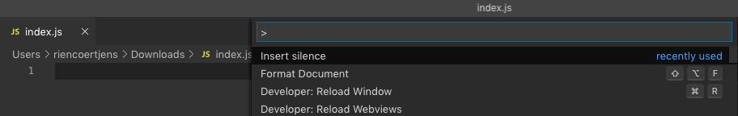

# Silence is Golden README

Spice up your npm package empty index.js file (or any other empty files) with a fun quote about silence. Type `Insert silence` in command pallette (mac:`cmd+shift+p` windows:`ctrl+shift+p`) to clear the document and insert a random quote.

## More Info

This is my first VS Code extension, I just had the idea and wasted my afternoon with it 🤦🏻‍.

Icon made by [Freepik](https://www.flaticon.com/authors/freepik) from [Flaticon](https://www.flaticon.com/)

### Help me help you

See anything wrong? Suggestions for a change? Want to **add a quote?** PR or new issues are welcome!
 
https://github.com/riencoertjens/silence-is-golden-vscode-extension.git

[How to make your first PR on GitHub](https://www.freecodecamp.org/news/how-to-make-your-first-pull-request-on-github/)

### Ideas

- Get quotes from a quote API.

## Known Issues

quote is commented with `//` hardcoded into it, so might not work with all filetypes.

## Release Notes

### 1.0.0

Initial release of Silence is golden

---

**Enjoy!**
